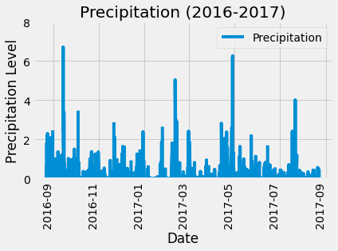
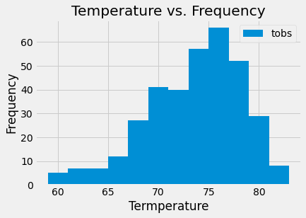

# sqlalchemy-climate
Explore .sqlite files with sqlalchemy to analyze a climate database. 

## Repository Structure
[SQLAlchemy | Data Analysis](Notebooks/climate_sqlalchemy.ipynb)   

[Generated Graphs](Images)   

[Referenced Datasets](Data)   

## Climate & Precipitation Analysis

This project undertakes analysing Honolulu, Hawaii climate/precipitation data. The primary goal of this project is to stretch into SQLAlchemy and complete and analysis with: SQLAlchemy ORM queries, Pandas, and Matplotlib. What trends can we uncover by looking through this data? Where may be the best place to visit in this given dataset? Let's find out! 

## Precipitation Data Findings 

* Start by finding the most recent date in the data set.
* Using this date, retrieve the last 12 months of precipitation data (through queries).
* Select the date and prcp values for analysis.
* Load the query results into a Pandas DataFrame.
* Sort the DataFrame values by date.
* Plot the results using the DataFrame plot method.

  

## Climate Data Findings

* Design a query to calculate the total number of stations in the dataset.
* Design a query to find the most active stations.
* List the stations and observation counts in descending order.
* Which station id has the highest number of observations?
* Using the most active station id, calculate the lowest, highest, and average temperature.
* Design a query to retrieve the last 12 months of temperature observation data (TOBS).
* Filter by the station with the highest number of observations.
* Query the last 12 months of temperature observation data for this station.
* Plot the results as a histogram.

